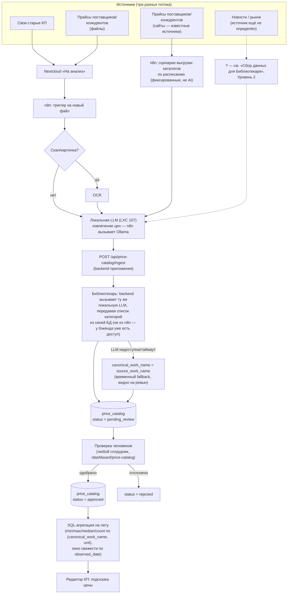

# Phase 10: Каталог цен и подсказки при заполнении КП — план

**Статус:** app-side фундамент реализован и вручную протестирован (2026-08-06) — схема БД,
`ingest`/проверка/`reference`-API, обе страницы UI (`/dashboard/price-catalog`,
`/dashboard/price-catalog-reference`), включая второй раунд UI-правок (реоткрытие
отклонённых/одобренных записей, детализация «похоже на существующее», просмотр источника
извлечения). Библиотекарь **реализован в коде** (`backend/src/services/librarianService.js`),
модель для `OLLAMA_MODEL` выбрана по итогам тестирования на реальных данных
(2026-08-07, 5 раундов, см. «Тестирование библиотекаря на реальных данных» ниже) —
**`devstral:24b`**, 0/31 ошибок на финальном тестовом наборе, 0/8 на критичных over-merge
кейсах. Реальное подключение (сеть до Ollama, `.env` на конкретном окружении) — остаётся сделать
пользователю; код готов принять любую модель через переменную окружения.
**Заменяет:** [PHASE_10_AI_PRICE_INTELLIGENCE.md](PHASE_10_AI_PRICE_INTELLIGENCE.md) (черновик,
первый набросок идеи — открытые вопросы оттуда здесь либо закрыты решением, либо перенесены).
**Инфраструктурный прогресс** (LLM/OCR на GPU, отдельно от этого документа, не устарел):
[PHASE_10A_llm_infra_plan.md](PHASE_10A_llm_infra_plan.md).

**Цель:** извлекать цены на работы/услуги из документов (свои старые КП, прайс-листы
поставщиков/конкурентов) и — отдельным, пока не реализуемым потоком — из регулярного
веб-мониторинга рынка, формировать каталог цен с атрибуцией источника и подсказывать
диапазон цены оператору при заполнении позиции КП.

**Порядок:** после Phase 9 (редактор КП) — подсказка цены встраивается в уже готовый UI позиций.

**Независимая рецензия, раунд 1 (2026-08-06):** документ отправлен на критическую оценку другому
ИИ-агенту (намеренно — свежий взгляд без продолжения диалога, где план разрабатывался). Нашла
реальные архитектурные дыры (главная — `work_name` как хрупкий ключ агрегации без разделения
канонического/исходного названия, отсутствие дедупликации). Правки внесены по всему документу.

**Независимая рецензия, раунд 2 (2026-08-06):** тот же документ (уже с правками раунда 1)
отправлен на повторную рецензию. Нашла более тонкие дыры — в основном места, где два уже
принятых решения конфликтовали друг с другом (например: дедупликация по хешу вместе с окном
свежести по дате тихо «старили» повторно подтверждённую поставщиком цену; агрегация по имени
работы без учёта единицы измерения могла смешать цену за м² и за штуку в один диапазон). Все
находки раунда 2 тоже учтены ниже, помечены отдельно от раунда 1.

**Независимая рецензия, раунд 3 (2026-08-06):** узкий прицел — не искать новые идеи, а
проверить, не создали ли сами правки раунда 1/2 новых внутренних противоречий. Нашла, что одна
из правок раунда 2 (принудительный `confidence = 'low'` для похожих категорий от библиотекаря)
сама смешала два разных сигнала в одном поле — разделено на `confidence` + отдельный
`category_review_flag`. Плюс явная политика для `row_hash` vs ручной правки (самая значимая
находка раунда 3), транзакционность bulk-переименования, связь over-merge с порогом возврата к
`pgvector`, и явное уточнение роли `unit` в контракте библиотекаря. Рецензент отдельно подтвердил,
что конфликты раунда 1↔2 (дедуп/свежесть, агрегация/единицы, место библиотекаря, price_on_request/
nullable, bulk-merge/откат, API/диаграмма/схема) устранены полностью.

---

## Схема работы системы



Ключевой момент этой схемы: **внешний облачный ИИ нигде не участвует, кроме потенциально узла
«Новости»** — выгрузка каталогов с сайтов идёт через обычные n8n-сценарии (HTTP-запросы по
фиксированным адресам, без ИИ), а обработка их результата — та же локальная LLM, что уже
занимается документами. Облако — не архитектурный компонент по умолчанию, а точечный
резерв только для той части, где сам подход ещё не определён (см. ниже).

**Место работы библиотекаря уточнено в раунде 2 рецензии.** Раньше диаграмма рисовала
библиотекаря частью n8n/extraction-пайплайна, а текст ниже говорил про «момент
`pending_review`» — расхождение. Библиотекарю нужен список уже существующих канонических
категорий/имён — это данные из БД приложения; отдавать их наружу в n8n через отдельный API
ради этого избыточно. Решение: **библиотекарь вызывается сервером приложения** сразу после
приёма `ingest`-запроса (тот же локальный Ollama-эндпоинт, что и extraction, просто второй
вызов, теперь с бэкенда, а не из n8n). Если вызов к LXC падает или превышает таймаут — не
городим очередь/ретраи ради этого масштаба, а пишем запись с `canonical_work_name =
source_work_name` как понятный fallback (виден на ревью, человек поправит вручную).

---

## Зафиксированные решения

| Вопрос | Решение |
|---|---|
| Источники документов | Смешанно: свои старые КП + прайс-листы поставщиков/конкурентов |
| Атрибуция источника | Обязательна — различаем `own` / `competitor` / `supplier` (см. схему ниже) |
| Таксономия категорий работ | **LLM-«библиотекарь»** при записи (не векторный поиск при чтении) — см. раздел «Библиотекарь: категоризация при записи» ниже |
| Формат подсказки цены в редакторе | Диапазон (мин/макс/медиана) + количество источников, не одно число. Валидировано на реальном прайсе (Альфа Групп, 545 позиций) — см. нюансы ниже |
| Кто видит справочник цен | Любой аутентифицированный сотрудник — новая вкладка в NavRail, просмотр открыт всем (изменено по ходу планирования, см. «Доступ: NavRail и право редактирования» ниже) |
| Кто может редактировать/проверять `pending_review` | **Админ по умолчанию, право можно выдать конкретному сотруднику через страницу «Пользователи»** — сужено относительно более раннего решения «любой сотрудник»; см. раздел ниже |
| Частота загрузки документов | Постоянный процесс (папка Nextcloud «На анализ» + n8n-триггер), не разовая загрузка архива |
| Сбор данных для Библиотекаря (сайты поставщиков, мониторинг рынка) | **Три уровня сложности, облако — резерв третьей очереди, не план по умолчанию** — см. раздел «Сбор данных для Библиотекаря» ниже. Не реализуется в этом раунде |
| Страница «Справочник» в NavRail (просмотр `approved`-каталога) | Отдельная от `/dashboard/price-catalog` (очередь `pending_review`) страница. Видна всем сотрудникам (просмотр), редактирование — только `admin`, без точечной выдачи прав. См. раздел «Страница «Справочник»» ниже |

---

## Библиотекарь: категоризация при записи (заменяет открытый вопрос о таксономии)

Существующий фиксированный список категорий устарел и не поспевает за реальными видами работ.
Рассматривали два варианта:

- **Векторный поиск (embeddings + `pgvector`) при чтении** — новая инфраструктурная зависимость
  (расширение БД, embedding-модель, вызов эмбеддинга в реальном времени при каждой подсказке в
  редакторе КП — то есть сетевой запрос к LXC 107 прямо в интерактивном UI).
- **LLM-«библиотекарь» при записи** — та же LLM, что уже используется для извлечения цен,
  один раз при появлении новой записи (в момент `pending_review`) сама решает канонические
  `category`/`work_name`, до подсказки в редакторе дело ещё не дошло.

**Выбран библиотекарь.** Решающий довод — реальный масштаб задачи, проверенный на прайсе
«Альфа Групп»: на 545 позиций всего **18 разделов работ** («Демонтажные работы»,
«Малярно-штукатурные работы», «Плиточные работы» и т.д.). Список такого размера целиком
помещается в промпт LLM без всякого поиска — векторный поиск был бы решением для тысяч
несвязанных категорий, у нас счёт на десятки. Плюс библиотекарь работает в фоне при записи
(уже проверяется человеком на `pending_review` — ошибка категоризации не критична, поймается
на ревью), а не в реальном времени при открытии редактора КП, где важна мгновенная скорость —
подсказка остаётся обычным SQL-запросом, без обращения к LLM.

**Явный порог возврата к векторному поиску (по итогам рецензии — раньше момент перехода не был
определён).** Отказ от `pgvector` оправдан только пока список категорий помещается в промпт
целиком. Возвращаемся к вопросу, если хотя бы одно из: количество различных `category`
превышает **150**, или доля новых категорий, предложенных библиотекарём (а не совпавших с
существующими), не снижается со временем, а продолжает расти — то есть свободная категоризация
не сходится к стабильному словарю, а расползается.

**Как это работает:**
1. При извлечении новой позиции библиотекарь получает на вход: извлечённые
   `source_work_name`/`unit`/`category` + список уже существующих канонических категорий и (в
   рамках выбранной категории — список там обычно короткий) уже существующих
   `canonical_work_name` — весь список помещается в промпт.
2. Обязан вернуть **контрактный (constrained) ответ**: для категории — либо точное совпадение
   с одной из существующих, либо явно новую; для названия работы — либо ссылку на существующий
   `canonical_work_name` (это одна и та же работа), либо явно новый канонический вариант (тот же
   принцип grammar-constrained JSON Schema, что уже заложен для extraction в
   `PHASE_10A_llm_infra_plan.md` — свободный текст без схемы даёт разнобой вроде «малярные
   работы»/«малярка» или «Шпаклевка стен»/«Шпаклевка стен в 2 слоя» как разных сущностей, хотя
   не факт, что они разные).

**`unit` передаётся библиотекарю, но не является частью его контракта (раунд 3 рецензии —
устранено концептуальное расхождение).** SQL-агрегация группирует по паре `(canonical_work_name,
unit)` (раунд 2), а библиотекарь при выборе `canonical_work_name` ориентируется только на смысл
работы, не на единицу измерения — «Монтаж» за м² и «Монтаж» за шт. для него могут оказаться одним
и тем же каноническим именем, хотя для SQL это две разные группы. Это не ошибка и не нужно
чинить синхронизацией контрактов: `unit` в промпте нужен библиотекарю только как **контекст**, не
как часть идентичности имени (например, чтобы не спутать «Монтаж (материалы заказчика)» и
«Монтаж под ключ», если единица измерения помогает это различить) — окончательное разделение по
единице всё равно происходит на уровне SQL независимо от решения библиотекаря, так что
рассинхрон между «одна сущность для LLM» и «две группы для SQL» безопасен по конструкции, а не
случайно терпим.
3. Итоговая запись в `price_catalog` попадает со `status = 'pending_review'` как обычно —
   решение библиотекаря тоже проверяется человеком, не считается окончательным автоматически.
   Человек на ревью видит и предложенный `canonical_work_name`, и то, с чем библиотекарь его
   сравнивал — может поправить вручную, если решил неверно.

**Цена в контексте канонизации (находка по итогам инфра-тестирования на реальных моделях,
2026-08-06).** Без цены в промпте библиотекарь судит о совпадении названий только по текстовому
сходству — а на реальном прайсе (Альфа Групп) это реальный риск: «Демонтаж перегородок из кирпича
(1/2 кирпича)» (535 ₽/кв.м) и «...из кирпича (1 кирпич)» (825 ₽/кв.м) текстуально почти идентичны,
но это разные по объёму работы с разной ценой — склеить их в одно `canonical_work_name` значило бы
испортить диапазон подсказки. Решение: во второй вызов (канонизация имени) добавлена цена
источника и цены уже существующих вариантов из списка options (`backend/src/services/
librarianService.js`, `formatCanonicalOption`/`formatSourcePrice`) — модели явно говорится, что
заметная разница в цене обычно означает разные по объёму/сложности работы, даже при похожих
названиях. **Важная деталь реализации:** ценовая пометка у вариантов — только подсказка для
сравнения, в промпте отдельно указано не включать её в `value` (иначе `canonical_work_name`
засорился бы текстом цены и агрегация по имени сломалась бы). Цены берутся по **любому статусу**
записи (не только `approved`) — на этом этапе это ориентир для суждения LLM, а не итоговая
статистика подсказки (та считается отдельно и только по `approved` в окне свежести, см. `GET
/reference`).

**Подсказка похожих категорий/названий при создании новых (раунд 1 рецензии).** Без этого через
несколько месяцев легко получить «Отделка» / «Отделочные работы» / «Внутренняя отделка» как
формально разные категории, которые никто не удосужится свести воедино. Решение — `pg_trgm`
(триграммное сравнение строк, встроено в PostgreSQL, не требует эмбеддингов — этого достаточно
при нашем масштабе, там же где отвергли `pgvector` для основного поиска).

**Уточнено в раунде 2 рецензии: диалог-подтверждение работает только для человека, не для
библиотекаря.** Библиотекарь работает автоматически в фоне — «спросить у него» нельзя, а
большинство новых категорий на практике будет создавать именно он, не человек руками. Поэтому:
если библиотекарь предлагает новую категорию/`canonical_work_name`, а `pg_trgm` находит похожую
существующую — запись не блокируется, но получает явную пометку «похоже на существующее: …» и
поднимается в очереди ревью. Диалог-подтверждение в интерфейсе остаётся только для случая, когда
категорию/каноническое имя создаёт вручную человек на странице проверки.

**Уточнено в раунде 3 рецензии: это отдельный сигнал от `confidence`, не одно и то же (правка
раунда 2 сама смешала два разных риска — округлённая рекурсия, которую поймал раунд 3).**
`confidence` отражает уверенность **извлечения** (плохо распознанный OCR, нечёткая формулировка
цены) — то, была ли LLM уверена в самих значениях. «Похоже на существующую категорию» — это
совершенно другой риск: значения извлечены прекрасно, но библиотекарь мог ошибиться именно в
категоризации. Если бы решение раунда 2 форсировало `confidence = 'low'` в этом случае, оператор
видел бы одинаковый `low` для «OCR не смог разобрать цифры» и для «возможно, это не новая
категория», хотя это разные проблемы с разным способом починки. Вместо этого — отдельное булево
поле `category_review_flag` (см. схему БД ниже): очередь ревью сортируется/фильтруется по обоим
сигналам независимо, не смешивая их в одном enum.

**Стратегия переименования канонических названий (раунд 1 рецензии).** Специальной подсистемы
версионирования справочника не заводим — это оверинжиниринг для масштаба компании. Переименование
= обычный bulk `UPDATE price_catalog SET canonical_work_name = '...' WHERE canonical_work_name =
'...'` (объединяет две группы в одну) — делает человек вручную на странице проверки, действие
попадает в журнал аудита (см. раздел «Схема БД» ниже) **по одной строке на переименованную
запись** (уточнено в раунде 2 — агрегированная запись аудита не позволила бы откатить merge
точечно, если объединили не то). История цен при этом не переписывается — старые записи просто
получают новое каноническое имя и участвуют в той же агрегации, что и новые.

**Индикатор обратной ошибки — over-merge (раунд 2 рецензии).** Порог возврата к `pgvector` выше
защищает от того, что категорий станет слишком много (расползание). Противоположная ошибка
опаснее и незаметнее: библиотекарь может, наоборот, склеить в одно `canonical_work_name` две
работы с реально разной ценой (например, «Шпаклёвка стен» и «Шпаклёвка стен в 2 слоя») — каждая
запись по отдельности выглядит корректно на ревью, ошибка видна только на уровне агрегата, когда
диапазон подсказки становится неоправданно широким. Специальной автоматики против этого не
строим — достаточно периодического ручного запроса-проверки: группы `(canonical_work_name,
unit)`, где `max(price) > 3 × min(price)` — почти всегда либо over-merge, либо перепутанная
единица измерения, стоит время от времени проверять этот список.

**Over-merge — тоже сигнал к пересмотру отказа от `pgvector` (раунд 3 рецензии).** Порог возврата
к векторному поиску (>150 категорий, либо расползание словаря) описывает одну сторону проблемы —
что библиотекарь перестаёт справляться с *различением* похожих категорий. Регулярный over-merge —
симптом той же самой болезни с другой стороны: библиотекарь перестаёт справляться с *различением*
похожих названий работ. Оба явления не изолированы друг от друга — если maintenance-запрос выше
регулярно показывает новые аномальные группы, это равноценный порогу в 150 категорий повод
пересмотреть отказ от `pgvector`, а не отдельная, более мелкая проблема, которую чинят только
точечными переименованиями.

На старте (пока каталог пуст) список существующих категорий стартует с 18 разделов из первого
загруженного прайса как разумной первой версии справочника — не жёстко зашитой, библиотекарь
может добавлять новые по мере появления работ, которых там нет.

**Библиотекарь реализуется вместе с app-side фундаментом, до деплоя на прод (уточнение по
итогам обсуждения раунда 2).** Никакой отдельной «переходной схемы» на время, пока библиотекаря
ещё нет, не требуется — ничего из этой фичи не уходит в прод, пока библиотекарь не готов и не
подключён. Fallback `canonical_work_name = source_work_name` в диаграмме выше — это не заглушка
на время разработки, а постоянный механизм на случай временной недоступности LXC уже после
запуска в проде (LLM легла/не ответила вовремя), не более того.

## Тестирование библиотекаря на реальных данных (2026-08-07, 5 раундов) — ✅ завершено

Прогнали контракт `{value, is_new}` (позже — `{reasoning, value, is_new}`, см. ниже) через
`/api/generate` (тот же эндпоинт, что использует прод-код) на реальном прайсе «Альфа Групп»
(545 позиций, 18 категорий) — сначала на синтетических кейсах, затем на всё более полном наборе
реальных пар. Итоговый набор (round 5) — 31 кейс: 12 категоризаций реальных позиций + 8 критичных
over-merge (реальные near-duplicate пары с разной ценой: диаметр отверстий, толщина ЖБ
перегородок, число модулей электрощита и т.д.) + 6 синонимов + 2 выбора из нескольких похожих +
2 заведомо новых позиции + 1 пустой справочник (первый ingest).

**Находка round 1 → 2 (самая значимая, изменила контракт).** Round 1 (7 кейсов, схема без поля
рассуждения): критичный over-merge кейс («Демонтаж перегородок из кирпича (1/2 кирпича)» 535 ₽
vs «...(1 кирпич)» 825 ₽) проваливали 3 из 4 работоспособных моделей — несмотря на цену в
контексте (см. «Цена в контексте канонизации» выше) и явную инструкцию не сливать. Причина
оказалась не в модели, а в механизме constrained/grammar decoding Ollama: **модель обязана
генерировать токены строго по порядку полей JSON Schema**, и если первым полем стоит
`value`/`is_new` — у неё физически нет места порассуждать до вердикта. Решение: добавить в схему
поле `reasoning` **первым** (`{"reasoning": "...", "value": "...", "is_new": ...}`), не
используется в коде (не парсится, не сохраняется), только меняет порядок генерации — эффект
подтверждён A/B на двух моделях: критичный кейс ушёл со 100% ошибок до 0% на обеих.

**Round 3 (31 кейс, два финалиста Phi-4 14B/devstral 24B):** оба **полностью закрыли критичный
over-merge (0/8)**, но общая точность просела на категоризации (9.7% и 12.9%) из-за двух
находок пользователя по структуре реального прайса (см. «Иерархия категорий», «Категория =
специальность бригады» ниже) и системной проблемы промпта категоризации — на позиции «Монтаж
систем умного дома» (заведомо новая категория) обе модели независимо уверенно выбирали
существующую «Электромонтажные работы» вместо признания новизны, даже при полноразвёрнутом
рассуждении (Phi-4 — 829 токенов, явно рассмотрела вариант «нужна новая категория» и всё равно
ошиблась) — не проблема нехватки места на рассуждение, самостоятельный prior модели «подобрать
правдоподобное существующее вместо декларации неопределённости».

**Round 4-5 (исправление найденных дефектов):** справочник категорий пересобран (пустышка
«Малярно-штукатурные работы» исключена, «Земляные работы» возвращены после находки пропущенного
заголовка в xlsx, добавлена подкатегория «Умный дом» под «Электромонтажные работы»), категориям
добавлены короткие описания (устраняет путаницу «умный дом» → «электромонтаж» — модели без
описаний используют только голое имя категории, этого недостаточно для тонких случаев), исправлен
попутно найденный баг (модель иногда копировала описание категории целиком в поле `value` —
исправлено защитной инструкцией в промпте по аналогии с уже работавшей для цены в канонизации).
**Итог round 5: devstral 24B и Phi-4 14B — 0/31 ошибок (0.0%), 0/8 на критичных кейсах**, впервые
за пять раундов. Полная сводка по всем 7 протестированным моделям, включая отсеянные (GLM-4,
GigaChat×2, DeepSeek-R1-Distill, 1-bit Bonsai) — в отчёте тестирования, не дублируется здесь.

**Выбор модели: `devstral:24b`.** При равном качестве с Phi-4 — почти вдвое быстрее (~5.1s/вызов
против ~9.3s), на полном прайсе (545×2 вызова) это ~93 минуты против ~169. Phi-4 — равноценный
запасной вариант, если/когда devstral окажется недоступен на конкретном железе.

**Qwen3-14B (3.2% ошибок, формально ниже порога 5%) — сознательно не рассматривается наравне с
финалистами.** Единственная его ошибка — провал именно критичного over-merge кейса (ЖБ
перегородки 200мм слились со 100мм несмотря на явную разницу цены в промпте) — то есть ровно тот
тип ошибки, который тестирование изначально старалось исключить. У обоих финалистов на этом типе
кейсов 0%.

**Что перенесено в код (`backend/src/services/librarianService.js`, `prompt_version =
'librarian-v2'`):**
- `reasoning` первым полем в JSON Schema, для обоих вызовов (категория и канонизация).
- Короткие описания категорий (`CATEGORY_DESCRIPTIONS`) в опциях категоризации — **черновая
  версия**, написана по собственному разбору структуры прайса, не является byte-exact копией
  версии, которой реально валидировался результат 0/31 (точный текст не был передан) — работает
  как есть (описание — чистый плюс к контексту), но для точного воспроизведения
  протестированного результата стоит сверить/заменить на вербатим-версию.
- **Ценовой guard rail при канонизации (независимо от чистого результата тестирования).** Если
  модель вернула `is_new:false`, но цена источника отклоняется от диапазона выбранного
  существующего варианта больше чем на 20% — запись всё равно помечается `category_review_flag`
  (не отменяет решение модели, только поднимает приоритет ручной проверки). Обоснование: выборка
  из 8 критичных кейсов статистически недостаточна, чтобы считать проблему закрытой навсегда, а
  cтоимость ошибки (испорченный диапазон подсказки цены) высока при низкой стоимости самой
  проверки — классический defense-in-depth. Порог откалиброван по 8 реальным парам с
  тестирования — минимальное отклонение среди них 24.8% («наливной пол», разная толщина заливки),
  порог взят заметно ниже, чтобы граничный случай не проскакивал мимо защиты.

**Открытые пункты, не блокируют текущее решение:**
- `confidence`-поле показало предварительную диагностическую пользу (у обоих финалистов ошибки
  не встречались со значением `абсолютная`), но выборка ошибок мала (3-4 случая) для
  статистических выводов — требует калибровки на большей выборке до того, как опираться на него
  для сокращения объёма ручного ревью в проде.
- Идея поля `alternative` (вторая по вероятности категория) для кейсов вроде «полотенцесушитель»
  (и сантехника, и отопление) — не реализована и не протестирована, требует отдельного раунда,
  если будет решено развивать это направление.
- Категория «Ландшафтное озеленение участка» осталась без подкатегории (в отличие от «умного
  дома») — оба финалиста корректно определяют её как `is_new: true` каждый раз; если такие позиции
  реально начнут появляться в прайсах, можно рассмотреть по той же логике, но сейчас в этом нет
  необходимости.

## Нюансы формата подсказки — проверено на реальном прайсе (Альфа Групп)

Прогнал реальный прайс-лист поставщика (`Прайс Альфа групп (надо обновлять стоимость).xlsx`,
545 позиций, 18 разделов) через дизайн формата подсказки — подтвердил решение
«диапазон (мин/макс/медиана) + количество источников», но выявил два нюанса:

- **Один прайс — не один источник цены, а до 7 колонок цены на позицию** (`цена`,
  `цена рабочих`, `цена 50%/30%`, скидки 5/7/10/15%) — все производные от одной и той же
  базовой цены поставщика, не независимые наблюдения. В `price_catalog` берём **только базовую
  `цена`** — иначе диапазон "мин/макс" считался бы по внутренней вилке скидок одного поставщика,
  а не по разбросу цен разных источников, и терял бы смысл.
- **Вырожденный случай `count = 1`.** Пока на позицию есть только один источник, диапазон
  схлопывается в одно число. API/UI подсказки должны явно показывать это как «535 ₽ · 1 источник
  (Альфа Групп)», не как бессмысленный диапазон «535–535 ₽».
- Отдельно подтверждено (не по этому файлу, а по второму листу того же документа): реальные
  прайсы бывают неструктурированными до такой степени, что число и единица измерения слиты в
  одну ячейку (`«от 250 р/м2»`) или вовсе нечисловые (`«по договору»`, `«цена договорная»`) —
  ещё один аргумент, что извлечение обязано идти через LLM + `pending_review`, а не через жёсткий
  парсер колонок.

### `price_qualifier` вместо булева `price_on_request` (раунд 2 рецензии)

Раунд 2 поймал две связанные проблемы старой схемы: (а) `«от 250 р/м2»` — это не фиксированная
цена и не «по договору», а нижняя граница, но записать её было решительно некуда (только
`price`, который систематически занизил бы диапазон, если положить туда голое 250 без пометки);
(б) `CHECK (price_on_request OR price IS NOT NULL)` формально разрешал одновременно
`price_on_request = TRUE` и заполненный `price` — на какой из трёх исходов подсказки должна была
попасть такая запись, было не определено. Оба решаются одной заменой: булев `price_on_request`
убран, вместо него — `price_qualifier VARCHAR(20) NOT NULL DEFAULT 'exact'` со значениями
`'exact' | 'from' | 'approx' | 'on_request'`, и ограничение ужесточено до точного взаимоисключения
(`CHECK (price_qualifier = 'on_request') = (price IS NULL)` — либо валидное число, либо явно
«по договору», третьего не дано на уровне БД).

### Три уровня ответа подсказки (не два)

`«по договору»` — это не мусор и не то же самое, что отсутствие источника вообще: источник
существует и явно говорит «цена не фиксирована», это тоже полезная информация оператору.
Поэтому подсказка различает три исхода, а не просто «есть цена / нет цены»:

1. **Есть хотя бы одна запись с `price_qualifier = 'exact'`** → обычный ответ: диапазон
   (мин/макс/медиана, или одно число при `count = 1`) + количество источников. Записи с
   `'from'`/`'approx'` в это число не подмешиваются (не участвуют в min/max/median) — но
   упоминаются отдельной пометкой, например «от 250 ₽ по данным ещё 1 источника», чтобы не
   потерять сигнал совсем.
2. **Подходят только записи `'from'`/`'approx'`/`'on_request'`** (нет ни одной `'exact'`) →
   явный fallback-ответ без диапазона: для `'on_request'` — «цена по договору», для
   `'from'`/`'approx'` — «от N ₽ (по данным поставщика)», с указанием количества таких
   источников. Числа не выдумываем и не смешиваем разные квалификаторы в один диапазон.
3. **Подходящих записей в каталоге нет вообще** → чёткий явный ответ «нет источников», не
   пустое место и не «0 ₽» — оператор должен однозначно понимать разницу между «мы не нашли
   данных» и «данные есть, но цена не фиксирована/не точна».

### Разбивка по типу источника вместо единого «веса» (по итогам рецензии)

Рецензия справедливо отметила: сейчас `min/max/median` считаются по всем источникам с
одинаковым весом — своя цена месячной давности и цена неизвестного конкурента из старого
документа влияют на диапазон одинаково. Полноценный числовой `trust_score`/`source_priority`
для масштаба компании — преждевременная сложность (лишняя таблица весов, которую некому
поддерживать). Дешёвая альтернатива, которая почти бесплатна благодаря уже существующей
атрибуции: **подсказка показывает разбивку по `source_type`**, а не только слепой диапазон —
например, «своя цена: 500 ₽ · поставщики: 550–600 ₽ (2) · конкуренты: 700 ₽ (1)» вместо одного
смешанного «500–700 ₽ (4 источника)». Решение о доверии остаётся за человеком, который видит
это на экране, а не зашивается в формулу.

### Окно свежести по умолчанию (раунд 1 рецензии)

`observed_date` до этой правки использовалась только для отображения — сам SQL-запрос считал
диапазон по всей истории без разбора дат, из-за чего цена 2023 года и цена этого месяца попадали
в одну медиану наравне (для строительных цен на фоне инфляции это может ощутимо искажать
результат). Полноценное взвешивание по давности — избыточно для этого масштаба, но простое
окно — нет: агрегация по умолчанию берёт **только записи не старше 12 месяцев**
(`WHERE observed_date >= now() - interval '12 months'`), с явной возможностью показать более
старые данные отдельно, если свежих источников на позицию нет вообще (лучше старая цена с явной
пометкой давности, чем пустой ответ).

**Конфликт окна свежести с дедупликацией по хешу (раунд 2 рецензии — нашли, что два уже принятых
решения противоречили друг другу).** `row_hash` считался как `sha256` от «источник + исходное
название + единица + цена», без даты. Реалистичный сценарий: поставщик через квартал присылает
тот же прайс, где конкретная позиция не изменилась в цене — по сути, легитимное новое
наблюдение с новой датой, но `ingest` отклонил бы его как точный дубль (409), потому что хеш от
неизменных значений совпадает. В результате стабильная цена «стареет» в каталоге и через 12
месяцев выпадает из окна свежести, хотя поставщик всё это время держит её в актуальном прайсе —
подсказка ошибочно покажет «нет свежих источников» по позиции, которая на самом деле подтверждена
повторно. **Исправление:** при совпадении `row_hash` `ingest` не отклоняет запись, а **обновляет
`observed_date`** существующей строки на более свежую — это и есть верная семантика «источник
подтвердил ту же цену ещё раз», а не «это новое независимое наблюдение» (которое подняло бы
`count` без реальных оснований) и не «отказ» (который бы обнулил историю подтверждения).

### Единица измерения — часть ключа агрегации (раунд 2 рецензии)

Раньше агрегация шла по одному `canonical_work_name` — но одна и та же каноническая работа может
встречаться в каталоге с ценой за м², за п.м. или за штуку (например, разные источники считают
монтаж по-разному) — среднее по смеси единиц измерения даёт бессмысленный диапазон, и это не
ловится на ревью: каждая отдельная запись корректна сама по себе, ошибка есть только на уровне
агрегата. Решение — агрегировать (`GROUP BY`) не по одному `canonical_work_name`, а по паре
**`(canonical_work_name, unit)`**; эндпоинт подсказки соответственно тоже принимает и возвращает
единицу измерения, не только название работы (см. схему и API ниже). Контракт библиотекаря при
этом не меняется — не требуем, чтобы одно каноническое имя однозначно подразумевало одну единицу,
это было бы более хрупким требованием, чем просто расширить ключ группировки.

### Назначение поля `confidence` (раунд 1 рецензии)

Рецензия справедливо спросила: раз всё равно проходит ручную проверку, кто вообще смотрит на
`confidence`? Ответ, который раньше не был проговорён: **UI страницы проверки** —
`pending_review` сортируется/фильтруется по `confidence` (сначала показываем `low`, им нужно
больше внимания при ревью), это не декоративное поле и не участвует ни в какой автоматике.
`category_review_flag` (раунд 3 — см. «Библиотекарь») — независимый второй сигнал для той же
очереди, не альтернативное значение `confidence`: одна запись может быть одновременно
`confidence = 'high'` (LLM уверена в цифрах) и `category_review_flag = true` (но не уверена, что
категория действительно новая) — это два разных повода присмотреться, оператору полезно видеть
оба отдельно, а не гадать, что означает общий "low".

---

## Сбор данных для Библиотекаря: три уровня сложности (облако — резерв третьей очереди, не план)

Исходная инфраструктура (`PHASE_10A_llm_infra_plan.md`) сознательно **не даёт LXC 107/108
(Ollama, Open WebUI) выхода в интернет** — осознанное решение по безопасности, VPN вместо
публикации портов. Ранняя версия этого раздела предполагала облачный LLM-API как решение
ночного мониторинга — при дальнейшем обсуждении выяснилось, что это создавало путаницу
(«облако» звучало как принятая архитектура, а не как крайний случай) и что на самом деле
почти весь сбор данных можно и нужно сделать без единого обращения к облаку. Ниже — три
уровня по возрастанию сложности; переходим на следующий, только если предыдущий на практике
оказался недостаточным.

**Уровень 0 — файлы (уже решено, реализуется в этом раунде).** Сотрудник вручную кладёт
документ (свой старый КП, полученный от поставщика прайс) в папку Nextcloud «На анализ» →
n8n триггерится на новый файл → локальная LLM извлекает. Поиска здесь нет — источник находит
человек.

**Уровень 1 — известные сайты поставщиков/конкурентов со стабильным адресом.** Это
структурированные страницы с прайсами по фиксированному URL, не открытый поиск. n8n по
расписанию ходит на конкретный адрес и вытаскивает HTML/таблицу обычным HTTP-запросом —
никакого ИИ на этапе выгрузки. Если сайт рендерится через JS (отдаёт пустой HTML без браузера) —
переиспользуем Puppeteer, который уже настроен и работает в проекте для генерации PDF
(`backend/src/services/pdfService.js`): та же техника открывает страницу поставщика и снимает
текст. Результат уходит в тот же локальный конвейер извлечения, что и файлы с Уровня 0 — ИИ
(локальный) занимается только разбором текста в `{работа, цена}`, не поиском.

**Это оптимистичное описание, не решённая задача (раунд 1 рецензии).** «HTTP или Puppeteer»
покрывает идеальный случай стабильного сайта без защиты. На практике реальные проблемы обычно
другие и заранее неизвестно, какая из них всплывёт на конкретном сайте: Cloudflare/анти-бот
защита, CAPTCHA, rate limiting, авторизация для доступа к прайсу, прайс отдаётся как PDF/Excel-
файл по ссылке вместо HTML, разные форматы у каждого поставщика без единого шаблона парсинга.
Архитектуру ради этого не меняем — но фиксируем явно: под каждый конкретный сайт при подключении
Уровня 1 понадобится своя, штучная настройка сценария в n8n, это не одна универсальная
реализация на все источники сразу.

**Юридическая сторона регулярного автоматического скрейпинга (раунд 2 рецензии).** Это не только
техническая задача — постоянный, по расписанию, сбор данных с сайтов конкурентов/поставщиков
может затрагивать их условия использования. Для внутреннего некоммерческого использования
(подсказка цены сотрудникам, не публикация/перепродажа данных) риск оцениваем как невысокий —
осознанно принимаем его, отдельного юридического согласования не заводим. Фиксируем здесь просто
как явное решение, не как слепое пятно.

**Отравление данных через недоверенный контент (раунд 2 рецензии — важное отличие от риска
prompt injection у общего ИИ-помощника).** Сайты конкурентов и новостные ленты (Уровень 2) — это
не только полезные данные, но и потенциально враждебный вход для локальной LLM. Эксфильтрации
тут не возникает (LXC 107/108 по-прежнему без доступа в интернет — это уже хорошая защита сама
по себе), но остаётся риск **отравления каталога**: страница может содержать текст, который
extraction добросовестно превратит в правдоподобную, но полностью выдуманную цену, а ревьюер,
не видя исходную страницу, одобрит запись просто потому, что число выглядит правдоподобно.
Минимальная защита: для источников с `source_type IN ('competitor', 'market_scan')` в
`raw_extraction` обязательно сохраняется **фрагмент исходного текста**, из которого извлечена
цена (не весь документ — просто достаточно контекста, пара предложений), и этот фрагмент
показывается на экране проверки рядом с извлечённым значением — человек сверяет цифру с реальным
источником, а не судит на глаз о правдоподобности.

**Уровень 2 — мониторинг рынка/новостей (единственная реально неопределённая часть).** Здесь
нет фиксированного адреса — нужно «следить за рынком» в широком смысле. Три под-варианта,
пробуем по порядку:

1. **Куратор-список источников (MVP, стартуем с этого).** Один раз вручную выбираем и
   утверждаем конкретные RSS-ленты/сайты стройиндустрии, которым доверяем. n8n по расписанию
   скачивает именно эти источники — снова обычный HTTP/RSS-узел, без всякого поиска. Локальная
   LLM читает текст статьи и выцепляет упоминания цен/трендов — той же техникой, что и для
   документов. Ноль новой инфраструктуры, ноль обращений к облаку.
2. **Свой поисковик (SearXNG), если куратор-список окажется слишком узким.** Ещё один лёгкий
   self-hosted LXC с метапоиском (агрегирует результаты как поисковик, но полностью на своих
   серверах, без API-ключей и без утечки запросов наружу в чей-то облачный сервис). Локальная
   LLM формулирует поисковый запрос, получает от SearXNG ссылки/сниппеты, читает их. Больше
   движущихся частей, но всё ещё без единого обращения к постороннему облаку.
3. **Облачный LLM с веб-поиском — крайний резерв.** Только если варианты 1 и 2 на практике не
   дают нужного качества. Не архитектурная зависимость по умолчанию, а fallback, который нужно
   отдельно обсуждать и утверждать, если до него дойдёт.

Ни один из трёх уровней (включая Уровень 2 целиком) **не реализуется в этом раунде** — это
отдельная задача на потом, начинать стоит с MVP (куратор-список), когда до неё дойдёт очередь.
Для app-side фундамента, который делаем сейчас, это не блокер: `price_catalog` в любом случае
принимает данные только через `ingest`-эндпоинт (независимо от того, откуда n8n их взял —
файл, сайт поставщика или новостная лента) с `source_type = 'market_scan'` для Уровня 2 и
обязательной проверкой человеком (`pending_review`) — источник любого типа не более доверенный,
чем загруженный файл, пока не одобрен.

**Смежная, но отдельная инициатива (сознательно не объединяется с этим решением):** есть желание
дать сотрудникам общего ИИ-помощника с доступом и к приватным документам компании, и к интернету
(например, помощь с Excel-файлами). Это описано отдельным документом
(`~/Projects/ai-помощник-концепция.md`, вне этого репозитория) — не Phase 10, требует
собственного анализа рисков (в первую очередь — prompt injection → эксфильтрация данных при
сочетании доступа к приватным файлам и открытому интернету в одной модели/сессии) до реализации.

---

## Схема БД (`price_catalog`)

Одна основная таблица, без отдельной `pending_review` — на этом масштабе действует тот же
принцип `status`-поля, что уже используется в проекте (`is_active` у шаблонов/КП). Хранятся
отдельные точки цен, а не готовые диапазоны — диапазон (мин/макс/медиана) считается на лету
запросом при показе подсказки, чтобы не протухал при появлении новых данных.

**Разделение `source_work_name`/`canonical_work_name` (раунд 1 рецензии — самая важная правка в
этом документе).** Раньше в схеме было одно поле `work_name`, и агрегация диапазона шла прямо по
нему — из документа не было понятно, что считается «той же работой», и любая непоследовательность
библиотекаря между двумя разными загрузками (сегодня выбрал одно каноническое имя, через месяц
слегка другое для той же по сути работы) тихо ломала статистику, раздваивая её на две группы
вместо одной. Теперь:
- `source_work_name` — название ровно как оно было в источнике (или как ввёл человек), не
  трогается, нужно для аудита/отладки извлечения.
- `canonical_work_name` — решение библиотекаря (или человека при ревью), **по паре с `unit`**
  (см. «Единица измерения — часть ключа агрегации» выше) идёт вся агрегация
  (`GROUP BY canonical_work_name, unit`), не по исходному тексту и не по одному имени без учёта
  единицы.

```sql
CREATE TABLE price_catalog (
  id                  UUID PRIMARY KEY DEFAULT gen_random_uuid(),
  source_work_name    VARCHAR(500) NOT NULL, -- название работы как есть в источнике/вводе, не трогаем
  canonical_work_name VARCHAR(500) NOT NULL, -- решение библиотекаря/человека — часть ключа агрегации подсказки
  category            VARCHAR(255),           -- каноническая категория от библиотекаря (см. раздел выше)
  unit                VARCHAR(50) NOT NULL,   -- нормализованная ед. изм. (м2, шт, п.м, ...) — вторая часть ключа агрегации
  price               NUMERIC(12,2),          -- NULL допустим только если price_qualifier = 'on_request'
  price_qualifier     VARCHAR(20) NOT NULL DEFAULT 'exact', -- 'exact' | 'from' | 'approx' | 'on_request' (раунд 2 — заменяет булев price_on_request)
  currency            VARCHAR(3) NOT NULL DEFAULT 'RUB', -- на будущее для market_scan-источников (раунд 2)
  source_type         VARCHAR(20) NOT NULL,   -- 'own' | 'competitor' | 'supplier' | 'market_scan'
  source_detail       TEXT,                   -- путь к файлу / URL — см. «Формат source_detail» ниже
  observed_date       DATE NOT NULL,          -- дата документа/скана — ОБЯЗАТЕЛЬНА, без неё непонятна актуальность цены
  status              VARCHAR(20) NOT NULL DEFAULT 'pending_review', -- 'pending_review' | 'approved' | 'rejected'
  confidence          VARCHAR(20),            -- 'low' | 'medium' | 'high' — уверенность ИЗВЛЕЧЕНИЯ (OCR/цена/единица), не категоризации
  category_review_flag BOOLEAN NOT NULL DEFAULT FALSE, -- pg_trgm нашёл похожую категорию — отдельный сигнал от confidence (раунд 3)
  category_review_details JSONB,              -- НА ЧТО похоже (второй раунд UI-правок, 2026-08-06): {"category": {"value","similarity"}, "canonical_work_name": {"value","similarity"}} — показывается ревьюеру вместо голого флага
  model               VARCHAR(100),           -- какая LLM извлекала/категоризировала (аудит — раунд 1)
  prompt_version      VARCHAR(50),            -- версия системного промпта на момент извлечения (аудит — раунд 1)
  row_hash            VARCHAR(64) NOT NULL,   -- sha256(source_detail + source_work_name + unit + price) — дедупликация, БЕЗ даты (см. ниже)
  raw_extraction      JSONB,                  -- полный сырой ответ LLM + фрагмент исходного текста для competitor/market_scan (раунд 2) — аудит формата
  reviewed_by         UUID REFERENCES users(id),
  reviewed_at         TIMESTAMP,
  created_at          TIMESTAMP DEFAULT CURRENT_TIMESTAMP,
  updated_at          TIMESTAMP DEFAULT CURRENT_TIMESTAMP,
  CONSTRAINT price_catalog_price_or_qualifier CHECK ((price_qualifier = 'on_request') = (price IS NULL))
);

CREATE UNIQUE INDEX idx_price_catalog_row_hash ON price_catalog(row_hash);
CREATE INDEX idx_price_catalog_status ON price_catalog(status);
CREATE INDEX idx_price_catalog_canonical_work_name_unit ON price_catalog(canonical_work_name, unit);
CREATE INDEX idx_price_catalog_source_type ON price_catalog(source_type);
CREATE EXTENSION IF NOT EXISTS pg_trgm;
CREATE INDEX idx_price_catalog_canonical_work_name_trgm ON price_catalog USING gin (canonical_work_name gin_trgm_ops);
CREATE INDEX idx_price_catalog_category_trgm ON price_catalog USING gin (category gin_trgm_ops);
```

**Формат `source_detail` (по итогам ручного тестирования UI, 2026-08-06).** Поле — просто
строка, которую передаёт `ingest`-вызывающая сторона (n8n), backend её не парсит и не проверяет.
UI на странице проверки (`/dashboard/price-catalog`) показывает её как «Где искать:» — то есть от
формата напрямую зависит, сможет ли сотрудник реально найти документ. Решение, которое стоит
заложить при настройке n8n-сценария для Уровня 0 (файлы):
- Для файлов из Nextcloud — **полный путь внутри папки «На анализ»**, без домена/токена доступа
  (например, `/На анализ/Поставщики/Прайс_АльфаГрупп_март2026.xlsx`) — однозначно и не протухает,
  в отличие от временной ссылки; токен авторизации в это поле класть нельзя, оно видно всем на
  ревью.
- Для Уровня 1 (сайты поставщиков/конкурентов) — сам URL страницы, откуда взяли цену.

**Дедупликация через `row_hash` (раунд 1 рецензии, семантика уточнена в раунде 2).** Без этого
повторная загрузка одного и того же прайса (например, случайно дважды перетащили файл в папку
«На анализ») тихо удваивает `count` в подсказке и делает диапазон обманчиво «увереннее», чем он
есть на самом деле — источник фактически один, а не два. `row_hash` считается на этапе `ingest`
(сервер, не n8n и не LLM) как `sha256` от нормализованной связки «источник + исходное название +
единица + цена», **сознательно без `observed_date`** — иначе повторная присылка того же прайса с
новой датой не ловилась бы как дубль вообще, что противоречило бы самой цели хеша. При коллизии
`ingest` **не отклоняет запись, а обновляет `observed_date`** существующей строки (см. «Конфликт
окна свежести с дедупликацией по хешу» выше) — это и снимает конфликт с окном свежести, и сохраняет
защиту от случайного двойного перетаскивания файла. Осознанно **не** дедуплицируем по
`canonical_work_name` — одна и та же (по мнению библиотекаря) работа из двух разных реальных
источников — это ровно то, что должно попадать в `count` как два наблюдения.

**`row_hash` неизменяем после создания (раунд 2 рецензии).** Если ревьюер при проверке правит
цену (535 → 650) или каноническое имя через `PATCH`, `row_hash` не пересчитывается — он остаётся
«отпечатком» исходных значений на момент извлечения, а не текущего состояния записи. Это осознанный
выбор, а не недосмотр: пересчёт при `PATCH` потребовал бы обрабатывать конфликт уникального индекса
прямо в ручном редактировании (что делать, если пересчитанный хеш совпал с другой существующей
записью?) — а сама история правки и так полностью восстановима через `price_catalog_audit` (см.
ниже). Практическое следствие: если исходный файл с ценой 535 будет загружен повторно уже после
того, как ревьюер поправил её на 650, `ingest` увидит совпадение с исходным (уже неактуальным для
UI, но всё ещё хранимым) хешем и просто обновит `observed_date` — новая запись не создастся,
дублирования не будет, что и является целью дедупликации.

**Явная политика: ручная правка перевешивает повторно присланные сырые данные (раунд 3
рецензии — молчание превратилось бы в баг).** Раунд 3 указал на прямое следствие предыдущего
абзаца, которое нигде не было проговорено: если запись однажды поправили вручную (535 → 650), а
через месяц источник снова присылает документ с исходным значением 535 — по текущей логике
(совпадение `row_hash`) система просто обновит `observed_date`, **сохранив 650**, хотя
"свежайшее" сырьё от источника снова говорит 535. Технически это работает как описано выше, но
семантика была неявной. Фиксируем её осознанно: **ручное подтверждение человеком считается более
надёжным источником истины, чем повторно присланное сырьё**, и не переопределяется автоматически
без участия человека — весь смысл ручного ревью в том, что решение человека это финальная
проверка, а не промежуточный шаг, который сырой документ может тихо откатить назад. Если
источник действительно поменял позицию (а не просто прислал старый файл) — это будет видно как
новое расхождение при следующей ручной проверке той же позиции, не как автоматический откат.

**Журнал аудита правок (`price_catalog_audit`, по итогам рецензии).** `PATCH` сейчас разрешает
менять почти любое поле, включая саму цену — без журнала непонятно, кто и почему поменял 535 на
650. Отдельная простая таблица, не полноценное версионирование как у КП (это было бы избыточно
для данной сущности):

```sql
CREATE TABLE price_catalog_audit (
  id              UUID PRIMARY KEY DEFAULT gen_random_uuid(),
  price_catalog_id UUID NOT NULL REFERENCES price_catalog(id) ON DELETE CASCADE,
  changed_by      UUID NOT NULL REFERENCES users(id),
  changed_at      TIMESTAMP NOT NULL DEFAULT CURRENT_TIMESTAMP,
  before          JSONB NOT NULL, -- снимок изменяемых полей до правки
  after           JSONB NOT NULL  -- снимок изменяемых полей после правки
);

CREATE INDEX idx_price_catalog_audit_price_catalog_id ON price_catalog_audit(price_catalog_id);
```

Каждый `PATCH` (включая одобрение/отклонение и переименование `canonical_work_name` — см.
«Стратегия переименования» в разделе про Библиотекаря выше) пишет одну строку сюда до применения
изменения.

**Аудит покрывает только правки после создания записи (раунд 2 рецензии — уточнение, не пробел).**
«Кто/что создало запись» — это не вопрос к `price_catalog_audit`, а к самой записи: `model`,
`prompt_version` и `raw_extraction` уже фиксируют происхождение на момент `ingest` (LLM-извлечение
и решение библиотекаря). `price_catalog_audit` начинает жить только с первого `PATCH` — фиксируем
это явно, чтобы не искать несуществующую audit-запись о создании.

Только записи со `status = 'approved'` участвуют в расчёте подсказки цены — непроверенное
AI-извлечение никогда не показывается оператору напрямую (риск: OCR/LLM путают числа, единицы
измерения, категории — см. «Критичный риск» в черновике).

**`raw_extraction` и рост объёма (рассмотрено по итогам рецензии, решили не усложнять).**
Рецензия справедливо отметила, что JSONB с полным сырым ответом LLM на каждую запись в общем
инженерном смысле может разрастись. При реальном масштабе этой компании (не тысячи документов
в день, а нерегулярные загрузки) это не станет проблемой ещё очень долго — десятки тысяч записей
по паре КБ JSON каждая это единицы-десятки МБ, тривиально для PostgreSQL. Отдельная таблица или
TTL для этого поля — решение не существующей пока проблемы; не делаем сейчас, возвращаемся, если
объём реально станет измеримой проблемой на практике.

**Ретеншн `status = 'rejected'` (рассмотрено по итогам рецензии, решили не усложнять).**
Аналогично — при ожидаемых объёмах отклонённые записи не станут заметной нагрузкой в обозримом
будущем. Отдельная политика автоочистки — не сейчас, возможно понадобится позже, если/когда
объём это оправдает.

**`observed_date` обязательна.** Без даты источника невозможно понять, насколько цена ещё
актуальна (прайс-лист 2024 года и прайс-лист прошлой недели — совершенно разный вес для
подсказки). Если LLM не может извлечь дату из самого документа (например, скан без явной
даты) — `ingest` не должен просто оставлять поле пустым: fallback — дата загрузки файла (когда
он появился в папке «На анализ» / когда пришёл ingest-запрос), это тоже отдельно помечается в
`raw_extraction` (например, `"date_source": "extracted"` vs `"date_source": "upload_fallback"`),
чтобы при ревью в `pending_review` было видно, что дата не из документа, а приблизительная.
Подсказка в редакторе КП (когда до неё дойдём) должна показывать возраст источника оператору
(например, «535 ₽ · Альфа Групп, март 2026»), не только сам факт наличия даты.

---

## API (app-side фундамент — ✅ реализовано и вручную протестировано, 2026-08-06)

- **`POST /api/price-catalog/ingest`** — приём от n8n. Отдельный API-ключ, хранится в секретах
  (backend `.env` / хранилище credentials n8n, не открытым текстом в теле workflow — раунд 2
  рецензии), доступен только из внутренней сети (не публикуется наружу, как и остальной
  внутренний API). Валидация через Joi (та же дисциплина, что и остальные роуты). Сервер сам
  считает `row_hash` и при коллизии **обновляет `observed_date`** существующей записи вместо
  отклонения (см. «Конфликт окна свежести с дедупликацией» выше — раунд 2), сам вычисляет
  `observed_date` fallback, если не пришла в payload. После сохранения вызывает Библиотекаря
  (локальная LLM с бэкенда, см. диаграмму) для `canonical_work_name`/`category`, с fallback на
  `canonical_work_name = source_work_name`, если LLM недоступна. Всегда пишет со
  `status = 'pending_review'`, независимо от `confidence` в присланных данных.
- **`GET /api/price-catalog?status=&search=&limit=&offset=`** — список для проверки. JWT-auth,
  без ограничения по роли (любой сотрудник, см. таблицу решений выше). Сортировка по умолчанию —
  `confidence` (сначала `low`) плюс отдельный фильтр по `category_review_flag` (раунд 3 — два
  независимых сигнала, не смешиваются в один, см. «Назначение поля confidence» выше), поиск —
  в т.ч. похожие `canonical_work_name`/`category` через `pg_trgm`.
- **`PATCH /api/price-catalog/:id`** — одобрить/отклонить/поправить перед одобрением
  (`status`, и любое из `source_work_name/canonical_work_name/category/unit/price/
  price_qualifier/currency/source_type/source_detail`), простановка `reviewed_by`/`reviewed_at`.
  `row_hash` при этом **не пересчитывается** (см. «`row_hash` неизменяем» выше — раунд 2). Каждый
  вызов пишет строку в `price_catalog_audit` (до применения изменения) — см. схему выше.
  **Второй раунд UI-правок (2026-08-06):** возврат отклонённой записи обратно в
  `pending_review` — тоже через этот эндпоинт (`{status: 'pending_review'}`), но только `admin`
  (обычная проверка `pending_review` открыта всем, а переоткрытие уже принятого решения — более
  чувствительное действие, отдельно решили в этом раунде).
- **`GET /api/price-catalog/reference/sources?canonical_work_name=&unit=`** (добавлено во втором
  раунде UI-правок) — список одобренных записей, из которых складывается диапазон конкретной
  группы в «Справочнике» (тот же фильтр и окно свежести, что и агрегация) — кнопка «Показать
  источники» на странице «Справочник».
- **`POST /api/price-catalog/send-to-review`** (`{canonical_work_name, unit}`, добавлено во
  втором раунде UI-правок) — вернуть на пересмотр **все** одобренные записи группы разом, только
  `admin`. Со страницы «Справочник» отдельных id записей не видно (группа агрегированная) —
  поэтому это bulk-операция по той же схеме, что и `rename-canonical`: одна строка аудита на
  запись, вся операция в одной транзакции.
- **`POST /api/price-catalog/rename-canonical`** (`{from_canonical_work_name, unit,
  to_canonical_work_name}`) — массовое переименование (bulk `UPDATE`) в рамках одной единицы
  измерения, реализация «Стратегии переименования» из раздела про Библиотекаря. Намеренно
  отдельный путь, не `PATCH /api/price-catalog/rename` (раунд 2 — коллизия с `PATCH /:id`,
  Express мог бы принять `rename` за значение `:id` в зависимости от порядка регистрации роутов).
  Пишет в `price_catalog_audit` **по одной строке на каждую переименованную запись** (раунд 2 —
  агрегированная запись не позволила бы откатить merge точечно, если объединили не то). **Весь
  bulk `UPDATE` + вставка строк аудита выполняется в одной транзакции БД** (раунд 3 — иначе при
  обрыве операции на середине большого merge каталог остался бы в частично объединённом,
  непредсказуемом состоянии) — применяется целиком или не применяется вовсе.
- Эндпоинт подсказки цены (`GET /api/price-catalog/suggest?canonical_work_name=...&unit=...` →
  `{min, max, median, count, by_source_type, from_price_note, count_on_request, sources}` — оба
  параметра обязательны, раунд 2: единица измерения теперь часть ключа) — **не сейчас**,
  добавляется вместе с интеграцией в редактор КП (последний шаг, см. ниже), чтобы не
  проектировать вслепую раньше, чем будет реальный UI-контекст.

**✅ UI проверки реализован** (`/dashboard/price-catalog`, по образцу `templates/page.tsx`) —
построчное одобрение/правка с пагинацией, фильтр по статусу и по `category_review_flag`, поиск.
**Известное ограничение (по итогам рецензии, актуально):** без массовых действий («одобрить все
выбранные»). При ожидаемых объёмах (десятки-сотни строк за загрузку, не тысячи) это не должно
стать узким местом, но если реальная практика покажет обратное — это первое кандидатное
улучшение UI, не архитектурная проблема.

**Второй раунд UI-правок (2026-08-06, по итогам ручного тестирования пользователем)** — доведено
после первого прохода:
- Возврат отклонённой записи на проверку (`admin`), см. API выше.
- «Похоже на существующее» и «уверенность извлечения» — были статичными бейджами, стали
  кнопками-раскрывашками: показывают конкретные совпадения с процентом сходства
  (`category_review_details`) и содержимое `raw_extraction`/`source_detail`/модель извлечения
  соответственно — чтобы ревьюеру не нужно было ничего искать вручную вслепую.
- `date_source` (`extracted`/`upload_fallback`) переведён в понятную фразу для сотрудника, а не
  показывается как сырой технический ключ.
- Временная кнопка «Что есть что?» с текстовой шпаргалкой по карточке — можно убрать, когда
  сотрудники привыкнут к интерфейсу.
- Найден и исправлен баг CORS (`PATCH` не был в списке разрешённых методов на backend — одобрение/
  отклонение не работало вообще) и баг подсветки NavRail (`startsWith` ложно совпадал на
  `/dashboard/price-catalog` внутри `/dashboard/price-catalog-reference`).

---

## Страница «Справочник» (добавлено пользователем после раунда 3 рецензии) — ✅ реализовано

Отдельная от `/dashboard/price-catalog` страница — не очередь проверки, а **просмотр уже
одобренного каталога**: список уникальных `(canonical_work_name, unit, category)` с диапазоном
цены по каждому (та же агрегация, что будет использовать подсказка в редакторе КП). Полезна сама
по себе — сотрудник может посмотреть «а что у нас вообще есть в базе цен», не дожидаясь
интеграции подсказки в редактор.

**Разграничение прав — явно уточнено, чтобы не спутать с уже принятым решением про
`pending_review`:**
- **Кто проверяет `pending_review`** (одобряет/отклоняет/правит свежеизвлечённые записи,
  `/dashboard/price-catalog`) — **без изменений**, любой аутентифицированный сотрудник, как и
  зафиксировано раньше. Это отдельный вопрос от прав на «Справочник», не пересматривается.
- **Кто видит вкладку «Справочник» в NavRail и может просматривать** — все сотрудники (тот же
  принцип, что у шаблонов/КП — общий ресурс, полезный всем при заполнении КП).
- **Кто может редактировать уже одобренные записи справочника** (переименование
  `canonical_work_name` через `rename-canonical`, правка категории/юнита у одобренной записи,
  деактивация устаревшей позиции) — **только `admin`**, через уже существующий `requireAdmin`
  (тот же паттерн, что у `/dashboard/users` и `/api/users`, `backend/src/middleware/auth.js`).
  Точечная выдача прав отдельным не-админам **осознанно не делается** — это потребовало бы
  нового механизма разрешений (сейчас в `users` всего два значения `role`: `user`/`admin`, без
  точечных флагов), излишняя сложность для этого масштаба. Если понадобится — расширять
  отдельной задачей, не в рамках Phase 10.

**Реализация:** `frontend/components/layout/NavRail.tsx` — новый пункт навигации «Справочник»,
виден всем (без гейта по роли, в отличие от пункта «Пользователи»). Новая страница
`frontend/app/dashboard/price-catalog-reference/page.tsx` (по аналогии с `templates/page.tsx`:
поиск, пагинация), кнопки редактирования в разметке видны только при `role === 'admin'` (как уже
сделано в `users/page.tsx`), сами эндпоинты редактирования защищены `requireAdmin` на бэкенде
(фронтовая проверка — это UX, не граница безопасности). Отдельный `GET`-эндпоинт для этой
страницы (`GET /api/price-catalog/reference?search=&limit=&offset=` — список одобренных
`(canonical_work_name, unit)`-групп с агрегатом) добавляется вместе с остальным API этого раздела,
не выдумывается заново — это, по сути, тот же агрегирующий запрос, что и у будущего
`suggest`-эндпоинта, просто с пагинацией по всем группам вместо фильтра по одной позиции.

**Второй раунд UI-правок (2026-08-06):**
- Диапазон цены теперь явно показывает число и для «от»/«примерно», а не просто «+N источников
  без цифр» — иначе непонятно, к какой цене вообще относится пометка «от» (агрегация: `MIN(price)
  FILTER (WHERE price_qualifier IN ('from','approx'))`, отдельно от `on_request`).
- Кнопка «Показать источники» (все сотрудники) — разворачивает список конкретных записей, из
  которых считается диапазон группы (см. `GET /reference/sources` в API выше).
- Кнопка «На пересмотр» (`admin`) — вернуть всю группу в `pending_review`, если нужно поправить
  уже одобренные данные (см. `POST /send-to-review` в API выше).
- Адаптивная вёрстка: таблица на десктопе/планшете (`md` и шире), карточки (как на
  `/dashboard/price-catalog`) на мобильном — переключение чисто по Tailwind-брейкпоинту, без
  дублирования логики (общий компонент `GroupActions` для обоих режимов).

---

## Критерии успеха (по итогам рецензии — раньше отсутствовали)

Без измеримых ориентиров сложно понять, оправдала ли себя фича на практике, а не только
технически заработала. Ориентировочные метрики (не для отчётности, для собственной проверки):

- **Доля позиций КП, для которых подсказка вообще доступна** («есть источники» из трёх исходов
  подсказки) — растёт по мере накопления каталога, стартовая точка близка к нулю, это ожидаемо.
- **Доля ручных правок при проверке `pending_review`** (сколько записей библиотекаря/извлечения
  одобрено как есть vs потребовало правки цены/категории/канонического имени) — косвенный
  индикатор качества извлечения и категоризации; высокая доля правок в конкретной категории —
  сигнал, что промпт или модель для неё работают хуже.
- **Время на проверку одного документа** — если растёт непропорционально размеру документа,
  вероятно, разросся конфликт категорий/дублей, стоит вернуться к рецензии похожих.
- **Субъективная полезность** — самое простое: спросить у сотрудников через месяц использования,
  реально ли подсказка экономит время при заполнении КП, или её игнорируют.

**Проверка перед запуском в прод (раунд 2 рецензии).** Библиотекарь добавляет **второй**
LLM-вызов на каждую позицию сверх самого извлечения — прайс на 545 позиций (как «Альфа Групп»)
это 545 дополнительных вызовов категоризации. Оценку реального времени обработки одного крупного
прайса на своём железе (RTX 5060 Ti) стоит сделать до включения Библиотекаря в проде, чтобы
«фоновый» процесс не оказался многочасовым — это не вопрос данного документа, а конкретная задача
для `PHASE_10A_llm_infra_plan.md` (там же, где уже есть таблица замеров токенов/сек по моделям).

---

## Что осталось (актуально на 2026-08-07)

1. **Подключить выбранную модель в реальном окружении.** Код (`backend/src/services/
   librarianService.js`) реализован под победителя тестирования — `devstral:24b` (см.
   «Тестирование библиотекаря на реальных данных» выше), `.env.example` обновлён с
   рекомендацией. Осталось чисто инфраструктурное:
   - Убедиться, что модель `devstral:24b` реально загружена в Ollama на LXC 107, задать
     `OLLAMA_MODEL`/`OLLAMA_URL` в **боевом** backend `.env` (не в этой репе — на конкретном
     сервере/окружении, где крутится backend с сетевым доступом до Ollama).
   - Сверить/заменить `CATEGORY_DESCRIPTIONS` в коде на вербатим-версию из тестового скрипта,
     если нужна точная гарантия воспроизведения результата 0/31 (текущая версия — написана
     самостоятельно по структуре прайса, не идентична дословно, но работоспособна).
   - Прогнать через `ingest` несколько реальных позиций и посмотреть на `/dashboard/price-catalog`,
     как библиотекарь категоризирует и когда поднимает `category_review_flag` (включая новый
     ценовой guard rail — порог 20%) на настоящем окружении, не только в тестовом скрипте.
   - Прогнать реальный полный прайс (545 позиций) и сверить время обработки с оценкой (~93 минуты
     для devstral) — см. «Критерии успеха» выше, до включения в проде.
2. **n8n workflow для Уровня 0** (файлы) — Nextcloud «На анализ» → триггер → OCR (если скан) →
   extraction → `POST /api/price-catalog/ingest`. Формат `source_detail` — см. решение в разделе
   «Схема БД» выше (путь внутри «На анализ», без токена).
3. **Подсказка цены в редакторе КП** (`suggest`-эндпоинт + интеграция в `ItemsEditor`) — сознательно
   последний шаг, после того как в каталоге появятся реальные одобренные данные, чтобы не
   проектировать формат вслепую.
4. **Уровень 1/2 сбора данных** (сайты поставщиков, мониторинг рынка/новостей) — архитектура решена
   (три уровня сложности, облако — крайний резерв, см. выше), сами сценарии не реализуются, пока
   не заработает и не проверится Уровень 0.
